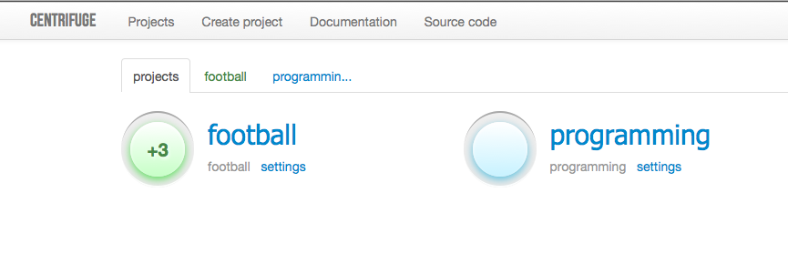
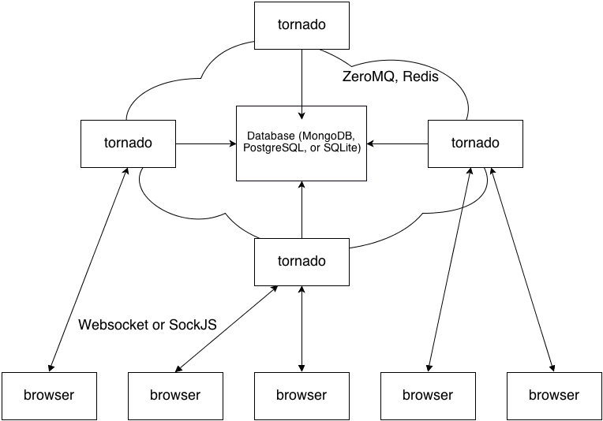
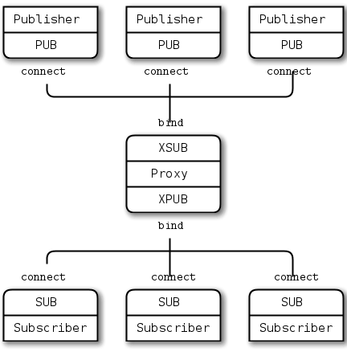

Overview
========

.. _overview:

What is it
----------

Centrifuge is a simple server for real-time messaging in web applications.

This is something like `Pusher <http://pusher.com/>`_ or `Pubnub <http://pubnub.com/>`_ services - not so powerful yet, but open-source,
self hosted and easy to setup. The closest analogue is `Faye <https://github.com/faye/faye>`_.

It is built on top of `Tornado <http://www.tornadoweb.org/en/stable/>`_ -
extremely fast and mature Python's async web server.

Centrifuge uses `ZeroMQ <http://www.zeromq.org/>`_ steroid sockets for internal
communication and publish/subscribe operations.

For presence and history data Centrifuge utilizes `Redis <http://redis.io/>`_ - advanced and super fast
in memory key-value store.

To connect to Centrifuge from browser pure `Websockets <http://en.wikipedia.org/wiki/WebSocket>`_
or [SockJS](https://github.com/sockjs/sockjs-client) library can be
used.

Centrifuge comes with administrative web interface to manage project/namespace structure and monitor important
messages.

Persistent data (projects, namespaces) by default stored in `SQLite <http://www.sqlite.org/>`_ database.
But when running Centrifuge instance processes on different machines you should use `MongoDB <http://www.mongodb.org/>`_
or `PostgreSQL <http://www.postgresql.org/>`_ backends instead of SQLite for structure management.

Where it can be useful
----------------------

Everywhere you need real-time web page updates.

There are tons of use cases where Centrifuge could be helpful - chat, graphs,
comments, counters, games etc.

Or you just want to know how many users currently watching web page and who they are.

How it works
------------

In a few words: clients from browsers connect to Centrifuge, after connecting clients subscribe
on channels. And every message which was published into channel will be broadcasted to connected
clients.

Now in details.

When you start Centrifuge instance you start Tornado instance on a certain port number.
That port number can be configured using command-line option ``--port`` .
Default value is 8000 and if this port number is free in your system you can omit ``--port``
option.

In general you should provide path to configuration file when starting Centrifuge instance
using ``--config`` option. You can start Centrifuge without configuration file but this is
not flexible and absolutely unsecure. Configuration file must contain valid JSON. It contains
cookie secret, administrative password, structure database settings and Redis settings. But
for now let's omit configuration file. By default Centrifuge will use unsecure cookie secret,
no administrative password, local SQLite storage as structure database and no Redis (no
presence and message history data will be available). This is normal only during development.
In production you always need to provide proper configuration file with secure settings.

So the final command to start one instance of Centrifuge will be

.. code-block:: bash

    centrifuge --config=config.json

There could be a problem if port 7000 is not free in your system. This is a default port for
ZeroMQ socket. If you have problems with running single instance you will find a way to change
that port number below.

As you started one instance of Centrifuge - clients from web browsers can start connecting to it.
There are two endpoints for connections - ``/connection`` for SockJS and
``/connection/websocket`` for pure Websocket connections. On browser side you now know the
url to connect - for our simple case it is ``http://localhost:port/connection`` in case of
using SockJS and ``ws://localhost:port/connection/websocket`` in case of using pure Websockets.
To communicate with Centrifuge from browser you should use javascript client which comes
with Centrifuge and provides methods for connecting, subscribing, listening for messages etc.

Ok, now you have one working instance. But sometimes it isn't enough and you need to run
more instances of Centrifuge and load balance clients between them. In case of several
instances you must do some additional work.

First, you must choose another port number (of course it is not necessary if you use
another machine for other instance).

Second, you must configure your load balancer. I suggest to use Nginx - you can find
its configuration example in this documentation. You should use Nginx in production in
case of single Centrifuge instance too. But in case of several instances it is an
almost critical requirement (you can do load balancing from client side but this is a
bad practice). Nginx is very fast and does some additional help, for example with
malformed request headers.

Third, new client can connect to any of running instances - if client publishes message
we must send that message to other clients including those who connected to another instance
at this moment. For this purpose Centrifuge uses ZeroMQ sockets. Every instance is binded
to publish socket. Every instance must be subscribed on all publish sockets of all
instances. In this way instances can communicate with each other using PUB/SUB mechanism.
Only in this case message will be delivered to all recipients. So to create an instance
in a proper way we must configure those sockets correctly. There are two ways of doing this.

First way - manually set instance's publish socket and all publish sockets current
instance must subscribe to. You should use these options for it. The drawback is that you
should support correct settings for all instances and restart all instances with new
socket configuration options when adding new instance.

.. code-block:: bash

    centrifuge --port=8000 --zmq_pub_port=7000 --zmq_sub_address=tcp://localhost:7000,tcp://localhost:7001
    centrifuge --port=8001 --zmq_pub_port=7001 --zmq_sub_address=tcp://localhost:7000,tcp://localhost:7001

Look, we selected two different ports for ZeroMQ PUB socket using ``--zmq_pub_port``
option. And we told every instance a comma-separated list of all PUB socket addresses
using ``--zmq_sub_address`` option. Instances now connected and you can load balance
clients between them.

Another way - use XPUB/XSUB proxy. Things will work according to this scheme.

In this case you only need to provide proxy endpoints in command-line options which will
be the same for all Centrifuge instances. Also you must run the proxy itself. The drawback
is that proxy is a single point of failure. There is proxy written in Go language. You
can run it instead of python version coming with Centrifuge.

.. code-block:: bash

    centrifuge --zmq_pub_sub_proxy --zmq_xsub=tcp://localhost:6000 --zmq_xpub=tcp://localhost:6001

We told Centrifuge to use XPUB/XSUB proxy using flag ``--zmq_pub_sub_proxy`` and set
XSUB (``--zmq_xsub``) and XPUB (``--zmq_xpub``) endpoints.

And to start proxy:

.. code-block:: bash

    xpub_xsub --xsub=tcp://*:6000 --xpub=tcp://*:6001

Now instances connected through XPUB/XSUB proxy. Success!

If you want to use Redis for PUB/SUB communication instead of ZeroMQ you
should run Centrifuge in this way:

.. code-block:: bash

    centrifuge --config=config.json --redis --redis_host=localhost --redis_port=6379

Our next step will be talking about how presence and history data for channels work.
For this tasks Centrifuge uses Redis. All instances of Centrifuge must have access to
information about presence and message history. Redis settings must be set up in
configuration file. As Redis settings set up correctly - every message published will
be added to history and every connected client sends presence information into Redis.
So if Redis available - information about presence and mesage history will be available
for clients (there are options for namespaces which allow to disable presence and
history for channels belonging to them).

At this moment you can ask why not use Redis PUB/SUB mechanism instead of ZeroMQ PUB/SUB
sockets for communicating and exchanging messages between instances? This is a fair question.
There are some benchmarks I found which show significant performance difference - ZeroMQ
just faster than Redis. But I think it is an open discussion and your thoughts are welcome.
Mail me or create Github issue so we can make Centrifuge better in next releases.

Finally let's talk about structure database. In Centrifuge you can create projects
and namespaces in projects. This information must be stored somewhere and shared between
all running instances. To achieve this SQLite or MongoDB or PostgreSQL can be used.
If all your instances running on the same machine any of them can be used. But if
you deploy Centrifuge on several machines it is impossible to use SQLite database.
To avoid making query to database on every request all structure information loaded
into memory and then updated when something in structure changed and periodically to
avoid inconsistency.

Now you know main things about how Centrifuge works. As may noted that there are some
possible single points of failure. You should deploy Centrifuge with awareness of this.
