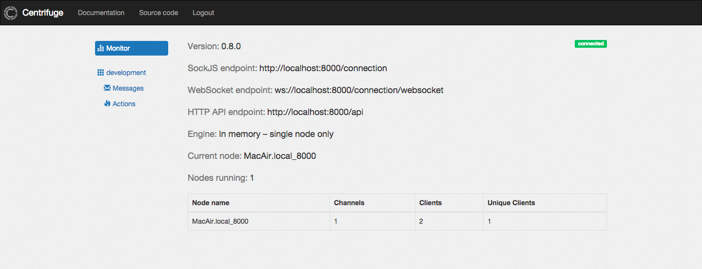

Overview
========

.. _overview:

Centrifuge is a server for real-time messaging in web applications.

Centrifuge server migrated to Go language - it's now called `Centrifugo <https://github.com/centrifugal/centrifugo>`_ and lives in another repo.

If someone wants to be Centrifuge maintainer to make it compatible with entire Centrifugal stack – write me email.

Version 0.8 is the last release of Centrifuge with new features. Here is a list of libraries versions compatible with Centrifuge:

* centrifuge-js `0.9.0 <https://github.com/centrifugal/centrifuge-js/tree/0.9.0>`_
* cent `v0.6.0 <https://github.com/centrifugal/cent/tree/v0.6.0>`_
* adjacent `v0.3.0 <https://github.com/centrifugal/adjacent/tree/v0.3.0>`_
* web `v0.1.0 <https://github.com/centrifugal/web/tree/v0.1.0>`_
* examples `v0.1.0 <https://github.com/centrifugal/examples/tree/v0.1.0>`_
* phpcent `0.6.1 <https://github.com/centrifugal/phpcent/tree/0.6.1>`_
* centrifuge-ruby `v0.1.0 <https://github.com/centrifugal/centrifuge-ruby/tree/v0.1.0>`_

Please, see `new documentation <http://fzambia.gitbooks.io/centrifugal/content/>`_ for the entire Centrifugal stack.

In a few words: clients (users of your web application/site) connect to Centrifuge from browser,
after connecting clients subscribe on channels. Every message which was published into that
channel will be delivered to all clients which are currently subscribed on that channel.

To connect to Centrifuge from browser pure `Websockets <http://en.wikipedia.org/wiki/WebSocket>`_
or `SockJS <https://github.com/sockjs/sockjs-client>`_) library can be used. So it works in both
modern and old browsers (IE 7 supported). Centrifuge has `javascript client <https://github.com/centrifugal/centrifuge-js>`_ with simple API.

Centrifuge is built on top of `Tornado <https://github.com/tornadoweb/tornado>`_ - fast and mature
asynchronous web server which can handle thousands of simultaneous connections.

Centrifuge scales using `Redis <http://redis.io/>`_ as PUB/SUB broker and central state store.
Single full-featured instance of Centrifuge run by default without extra dependency on Redis.

Centrifuge has administrative web interface to view configuration, monitor nodes state and watch
messages in real-time.

Centrifuge is useful everywhere you need real-time web page updates.

There are tons of use cases - chats, graphs, comments, counters, games or when you just want to know
how many users currently watching web page and who they are.

Centrifuge can be easily integrated with your existing web site - you don't need to change your project
architecture and philosophy to get real-time events. Just install Centrifuge and let your users connect
to it.

There are tons of examples in internet about how to add real-time events on your site. But very few
of them provide complete, scalable, full-featured, ready to deploy solution. Centrifuge aims to be
such a solution with simplicity in mind.
