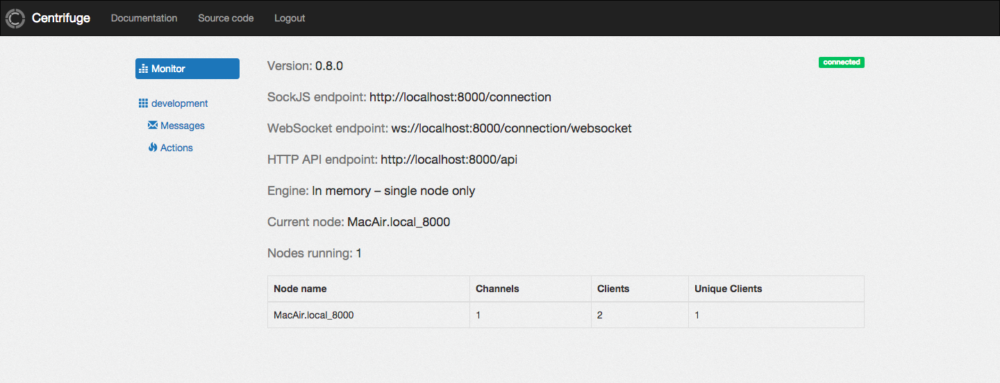

Web interface
=============

.. _web_interface:

Centrifuge has with administrative web interface. It's a ReactJS based single-page application.
You can find it in its `own repo <https://github.com/centrifugal/centrifuge-web>`_.

It allows to view projects, namespaces, publish JSON messages into channels etc.

Also you can see messages in your projects in real-time.

You can log in using **password** from configuration file.

Remember that in production you **must** always use strong password.
