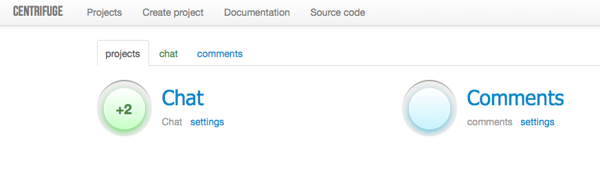
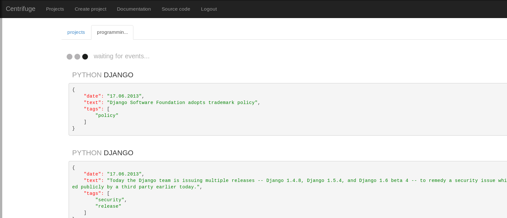
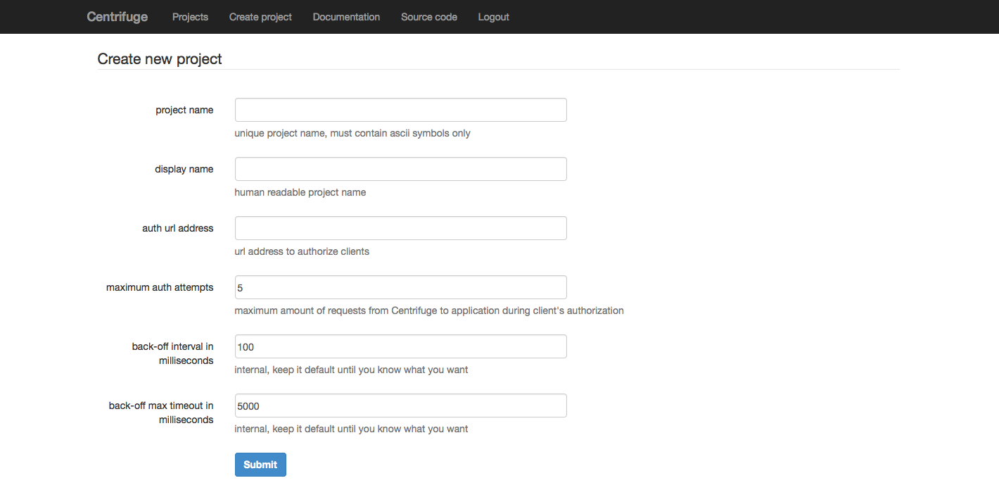
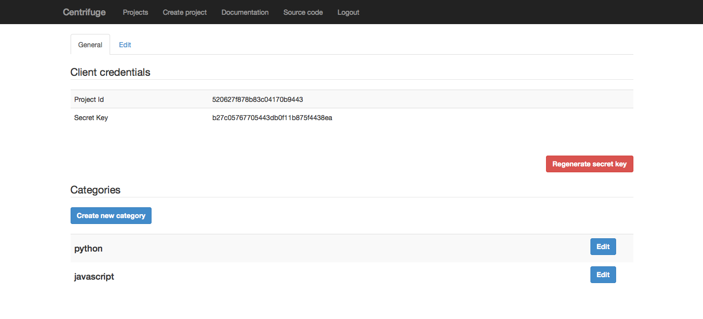
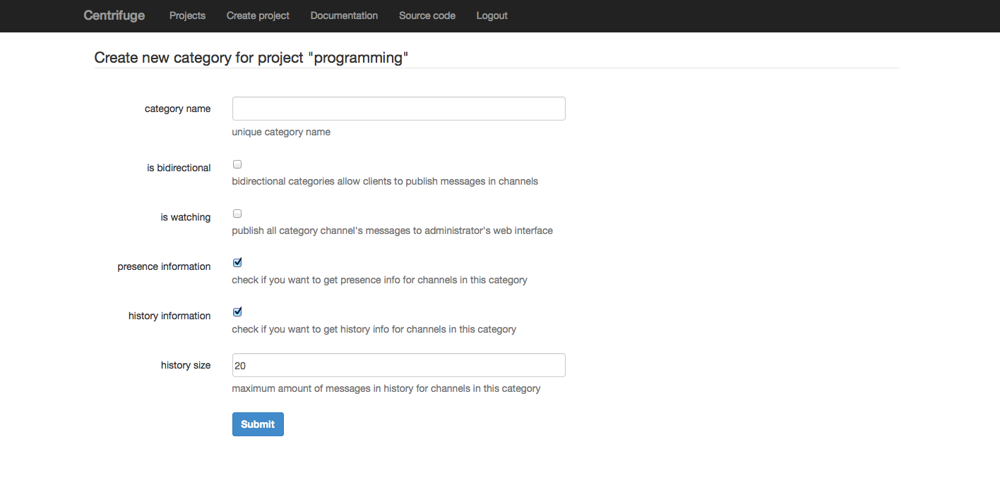

Web interface
=============

.. _web_interface:

Centrifuge comes with administrative web interface. Using it you can create
edit or delete projects and namespaces, manage users etc.

Also you can watch for new events appearing in your projects in real-time.

Logging in
~~~~~~~~~~

.. _login:

You can log into Centrifuge using password from configuration file.

If you did not set password in configuration file - you will be log in as
administrator automatically. But remember that this is normal only for
development stage. In production you should use strong password.

Creating new project
~~~~~~~~~~~~~~~~~~~~

.. _create project:

When you have running Centrifuge's instance and want to create web application using it -
first you should do is to add your project into Centrifuge. It's very simple - just fill
the form.

**name** - unique project name, must be written using ascii symbols only. This is project
slug, human-readable identity.

**display name** - project's name in web interface.

**auth address** - url for authorization purposes, when your web application's client
joins to Centrifuge - you can provide user id. Also you must provide permissions for
every connected user. More about user id and permissions later. Anyway this is an address
of your web application that will be used to authorize new client's connection. Centrifuge
sends POST request with user id and permissions to this url and your application must decide
to allow authorization or not.

**max auth attempts** - amount of attempts Centrifuge will try to validate user's permissions
sending POST request to ``auth address``

**back off interval** - at the moment when Centrifuge restarts your web application can
have lots of active connected clients. All those client will reconnect and Centrifuge will
send authorization request to your web application's ``auth address``. For such cases Centrifuge
has `exponential back-off <http://en.wikipedia.org/wiki/Exponential_backoff>`_ support to reduce
load on your application. This is time of back of minimum interval in milliseconds.

**back off max timeout** - maximum time in milliseconds for backoff timeout (time before client
connects to Centrifuge and sending authorization request to ``auth address``).

So project created, we are ready to continue.

Project settings
~~~~~~~~~~~~~~~~

.. _project settings:

Settings has several panels to customize your project.

First, you can regenerate your **secret key**. Secret key - is a key for encoding
all requests to Centrifuge from project administrators. If you want to send new
message to your project's clients you must send encrypted request (there is Cent -
python tools to communicate with Centrifuge, it also has terminal client to send
properly encoded requests to Centrifuge). Look at Cent documentation for more
information

In project settings you can also manage **namespaces**. Namespaces is a required
property for every new message. They help to manage permissions and behavior.
Every namespace must have unique name and can be one-way or bidirectional. In
bidirectional namespaces authorized clients can broadcast new events themselves.
This is important for chat-like applications.

You can change project settings which you set during creating project.

Finally, you can delete project.