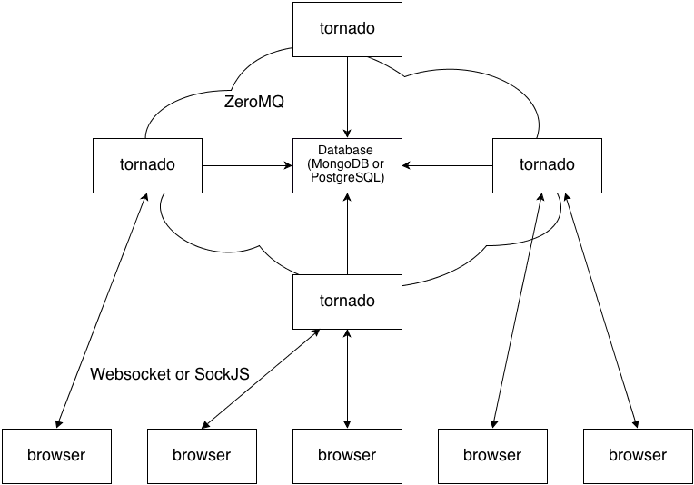

Architecture
============

.. _architecture:

In this chapter I'll try to tell about how Centrifuge is built.

Approximate architecture diagram
~~~~~~~~~~~~~~~~~~~~~~~~~~~~~~~~

How it works
~~~~~~~~~~~~

First of all - it is built on top of Tornado. This means that Centrifuge runs in a single process
asynchronously processing incoming requests. Of course you can run multiple processes and load
balancing between them (Deployment chapter focuses on this).

Web application clients connect to Centrifuge using pure Websockets or SockJS library.

The main goal of Centrifuge is message broadcasting. There are two ways message
broadcasting can be triggered:

- The first way - message published by project owner or admin with permissions. This can be done using client's script or terminal tool (Cent python package is exactly for this).

- The second - message published by connected user into channel in bidirectional category.

In any of those ways new message is published into appropriate channel of ZeroMQ socket.
And every client who subscribed on channel receives this message.
