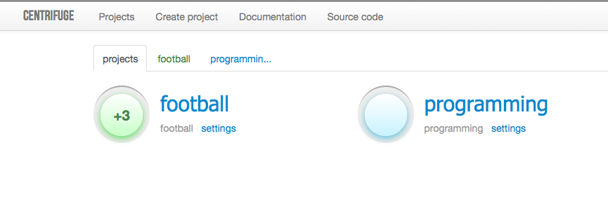

Overview
========

.. _overview:

What is it
----------

Centrifuge is light and simple platform for real-time message broadcasting in
your web applications. This is something like `Pusher <http://pusher.com/>`_ or
`Pubnub <http://pubnub.com/>`_ services - not so powerful yet, but open-source,
self hosted and easy to setup.

It is built on top of `Tornado <http://www.tornadoweb.org/en/stable/>`_ -
extremely fast and mature Python's async web server.

Centrifuge uses `ZeroMQ <http://www.zeromq.org/>`_ steroid sockets for internal
communication and publish/subscribe operations.

For presence and history data Centrifuge utilizes `Redis <http://redis.io/>`_ - advanced and super fast
in memory key-value store.

To connect to Centrifuge from browser pure `Websockets <http://en.wikipedia.org/wiki/WebSocket>`_
or [SockJS](https://github.com/sockjs/sockjs-client) library can be
used.

Centrifuge comes with administrative web interface to manage project/category structure and monitor important
messages.

Persistent data (projects, categories) by default stored in `SQLite <http://www.sqlite.org/>`_ database.
But when running Centrifuge instance processes on different machines you should use `MongoDB <http://www.mongodb.org/>`_
or `PostgreSQL <http://www.postgresql.org/>`_ backends instead of SQLite for structure management.

When it can be helpful
----------------------

Everywhere you need real-time web page updates and do not want to use existing
external hosted services like pusher.com or pubnub.com.

There are tons of use cases where Centrifuge could be helpful - chat, graphs,
comments, counters, games etc. Or you just want to know how many users currently
watching web page.

How it works
------------

Clients from browsers connect to Centrifuge, after connecting clients subscribe
on channels. And every message which was published into channel will be broadcasted
to connected clients.

It is built on top of Tornado. This means that Centrifuge runs in a single process
asynchronously processing incoming requests. Of course you can run multiple processes and load
balancing between them (Deployment chapter focuses on this).

Web application clients connect to Centrifuge using pure Websockets or SockJS library.

The main goal of Centrifuge is message broadcasting. There are two ways message
broadcasting can be triggered:

- The first way - message published by project owner or admin with permissions. This can be done using client's script or terminal tool (Cent python package is exactly for this).

- The second - message published by connected user into channel in bidirectional category.

In any of those ways new message is published into appropriate channel of ZeroMQ socket.
And every client who subscribed on channel receives this message.
