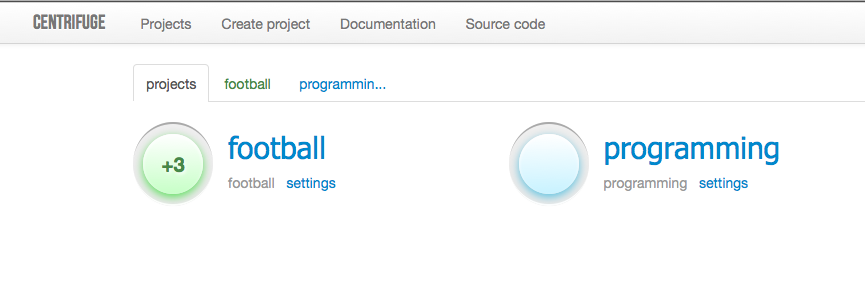

Overview
========

.. _overview:

What is it
----------

Centrifuge is light and simple platform for real-time message broadcasting in
your web applications. This is something like `Pusher <http://pusher.com/>`_ or
`Pubnub <http://pubnub.com/>`_ services - not so powerful yet, but open-source,
self hosted and easy to setup.

It is built on top of `Tornado <http://www.tornadoweb.org/en/stable/>`_ -
extremely fast and mature Python's asynchronous web server.

Centrifuge also uses `ZeroMQ <http://www.zeromq.org/>`_ sockets for internal
communication between process instances and publish/subscribe operations.

To connect to Centrifuge from browser pure `Websockets <http://en.wikipedia.org/wiki/WebSocket>`_
or `SockJS <https://github.com/sockjs/sockjs-client>`_ library can be
used. Please, read appropriate documentation chapter for better description
and look at examples.

When it can be helpful
----------------------

Everywhere you need real-time web page updates and do not want to use existing
external hosted services like pusher.com or pubnub.com.

There are tons of use cases where Centrifuge could be helpful - chat, graphs,
comments, counters etc.

How it works
------------

After installation and running Centrifuge on machine with Linux or MacOS X it
listens for incoming messages from your web application or from client of your
web application and broadcasts them to all clients of corresponding channels.

Centrifuge's name semantics
---------------------------

Why this is called Centrifuge? I found 2 meaningful reasons:

1) This reminds about `Sentry <https://getsentry.com/welcome/>`_ - great realtime
event logging and aggregation platform. Many design decisions here were inspired
by Sentry's architecture.

2) Centrifuge by default uses `Motor <http://motor.readthedocs.org/en/latest/>`_ -
MongoDb driver for Tornado. Motor is an important part of this project - like in all
real-world centrifuges.
