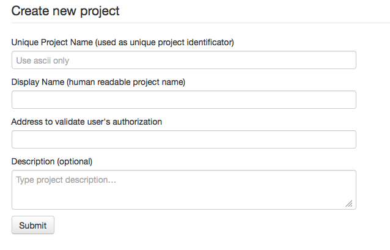

Creating new project
====================

.. _create project:

When you have running Centrifuge's instance and want to create web application using it -
first you should do is to add your project into Centrifuge. It's very simple - just fill
the form.

**name** - unique project name, must be written using ascii symbols only. This is project
slug, human-readable identity.

**display_name** - project's name in web interface. If empty - `name` will be used.

**validate_url** - url for authorization purposes, when your web application's client
joins to Centrifuge - you can provide user id. Also you must provide permissions for
every connected user. More about user id and permissions later. Anyway this is an address
of your web application that will be used to authorize new client's connection. Centrifuge
sends POST request with user id and permissions to this url and your application must decide
to allow authorization or not.

**description** - project's extended description

So project created, we are ready to continue.