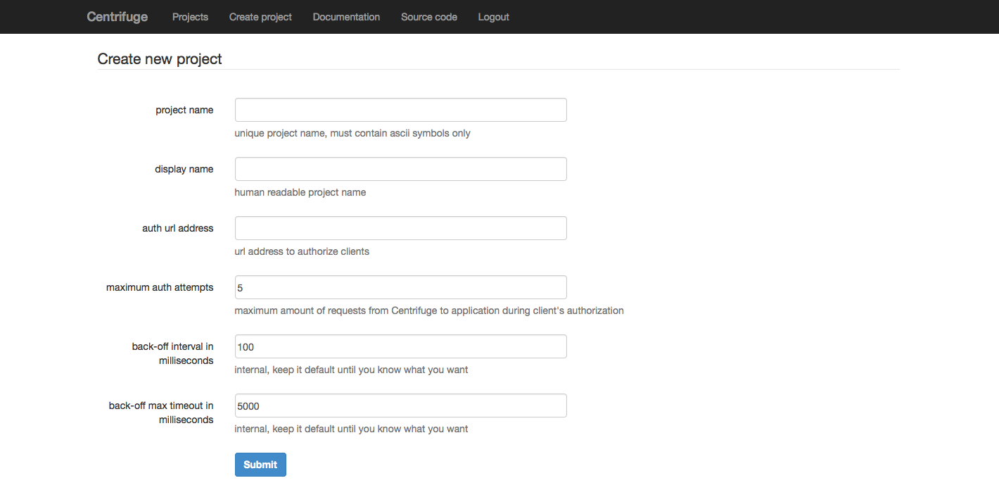

Creating new project
====================

.. _create project:

When you have running Centrifuge's instance and want to create web application using it -
first you should do is to add your project into Centrifuge. It's very simple - just fill
the form.

**name** - unique project name, must be written using ascii symbols only. This is project
slug, human-readable identity.

**display name** - project's name in web interface.

**auth address** - url for authorization purposes, when your web application's client
joins to Centrifuge - you can provide user id. Also you must provide permissions for
every connected user. More about user id and permissions later. Anyway this is an address
of your web application that will be used to authorize new client's connection. Centrifuge
sends POST request with user id and permissions to this url and your application must decide
to allow authorization or not.

**max auth attempts** - amount of attempts Centrifuge will try to validate user's permissions
sending POST request to ``auth address``

**back off interval** - at the moment when Centrifuge restarts your web application can
have lots of active connected clients. All those client will reconnect and Centrifuge will
send authorization request to your web application's ``auth address``. For such cases Centrifuge
has `exponential back-off <http://en.wikipedia.org/wiki/Exponential_backoff>`_ support to reduce
load on your application. This is time of back of minimum interval in milliseconds.

**back off max timeout** - maximum time in milliseconds for backoff timeout (time before client
connects to Centrifuge and sending authorization request to ``auth address``).

So project created, we are ready to continue.