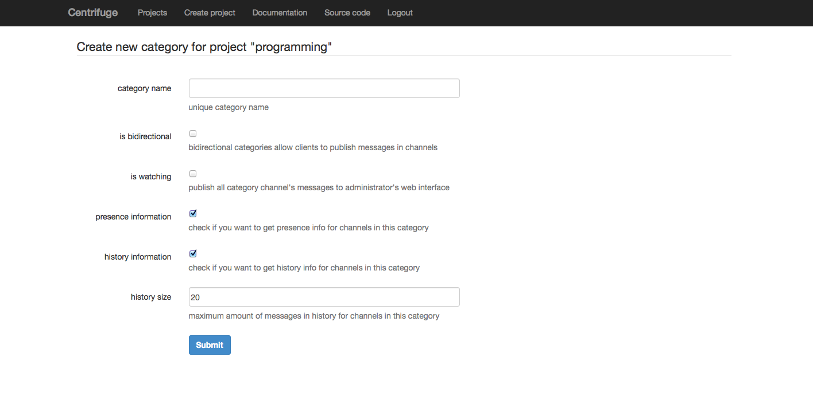

Project settings
====================

.. _project settings:

Settings has several panels to customize your project.

First, you can regenerate your **secret key**. Secret key - is a key for encoding
all requests to Centrifuge from project administrators. If you want to send new
message to your project's clients you must send encrypted request (there is Cent -
python tools to communicate with Centrifuge, it also has terminal client to send
properly encoded requests to Centrifuge). Look at Cent documentation for more
information

In project settings you can also manage **categories**. Categories is a required
property for every new message. They help to manage permissions and behavior.
Every category must have unique name and can be one-way or bidirectional. In
bidirectional categories authorized clients can broadcast new events themselves.
This is important for chat-like applications.

You can change project settings which you set during creating project.

Finally, you can delete project.